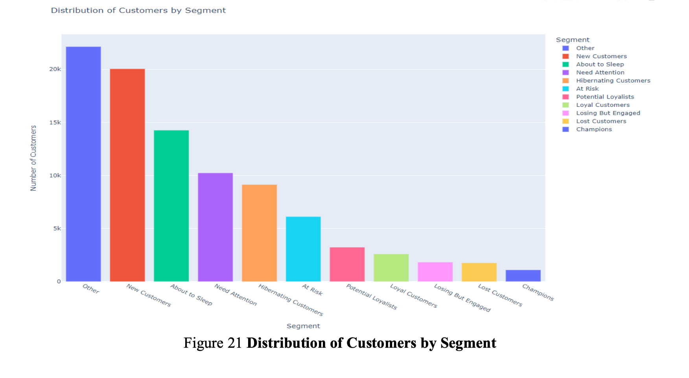

# Customer Segmentation using RFM & K-Means Clustering  
## Dashboard Preview  

## Project Overview  
This project analyzes customer behavior using **Recency, Frequency, and Monetary (RFM) analysis** and **K-Means clustering** to segment customers for targeted marketing strategies.  

## Key Highlights  
- Performed **RFM Analysis** to categorize customers into meaningful segments.  
- Applied **K-Means Clustering** to analyze customer purchasing behavior.  
- Created an **interactive Tableau Dashboard** for data visualization.  
- Estimated **Customer Lifetime Value (CLV)** to enhance business profitability.  

## Skills Used  
**SQL, Python (Pandas, NumPy, Scikit-Learn), Tableau, Data Visualization, K-Means Clustering, RFM Analysis**  

## Project Files  
- `rfm_analysis.py` – Python script for RFM calculations & clustering  
- `customer_segmentation.sql` – SQL queries for data extraction  
- `dashboard_screenshot.png` – Tableau dashboard preview  

